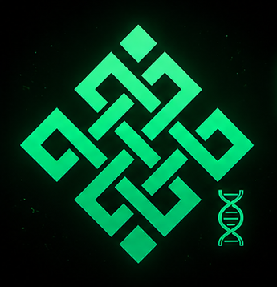

  

<h1 align="center">
  RitualArtDNA
</h1>

### AI-Powered Copyright Infrastructure for Digital Creators

RitualArtDNA is an experimental decentralized AI-powered artwork verification protocol designed to help creators prove ownership, authenticity, and originality of digital artworks in the emerging AI-native era.

Built with React, Web3 wallet infrastructure, blockchain verification concepts, NFT ownership certificates, and AI-powered verification systems, RitualArtDNA explores the future of decentralized creator protection.

Inspired by Ritual’s decentralized AI ecosystem.

---

## 🌐 Live Demo

https://ritualartdna.vercel.app/

---

## ⚡ Core Features

* AI Artwork Verification
* Blockchain Timestamp Verification
* NFT Ownership Certificates
* Wallet-Based Creator Identity
* QR Verification System
* Decentralized Creator Protection
* Future AI Similarity Detection

---

## 🧠 Vision

To build decentralized copyright infrastructure for the AI-native creator economy.

---

## 🏗 Architecture

RitualArtDNA is structured into several modular layers:

* Frontend Application Layer (React + Vite)
* Wallet Identity Layer (MetaMask / Web3)
* AI Verification Layer
* Blockchain Verification Layer
* NFT Ownership Certificate Layer
* QR Public Verification Layer
* Future Decentralized AI Infrastructure

---

## 🛠 Tech Stack

* React
* Vite
* JavaScript
* MetaMask
* Web3 Wallet Infrastructure
* QRCode.react
* Vercel Deployment

---

## 🚀 Current Status

Current MVP Features:

* Artwork Upload
* Wallet Connection
* QR Verification
* NFT Mint Simulation
* Local Artwork Storage
* Public Deployment

Project Status:
Experimental MVP Prototype

---

## 🔮 Future Plans

* Ritual Testnet Integration
* Smart Contract Deployment
* Real NFT Minting
* IPFS Storage
* AI Similarity Detection
* Plagiarism Scanner
* Creator Profiles
* Decentralized Verification Infrastructure

---

## ⚠ Disclaimer

RitualArtDNA is an independent experimental project inspired by Ritual’s decentralized AI ecosystem.

This project is not officially affiliated with Ritual.
